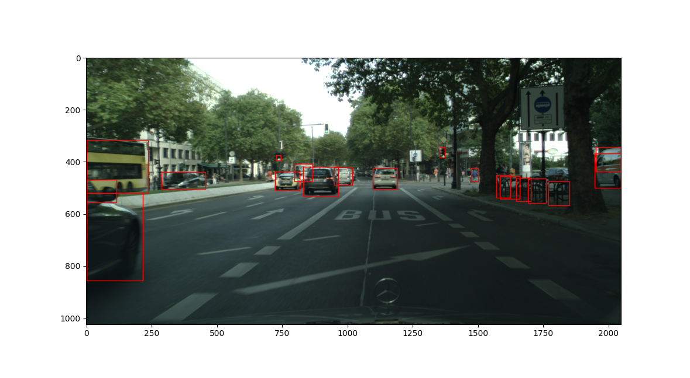
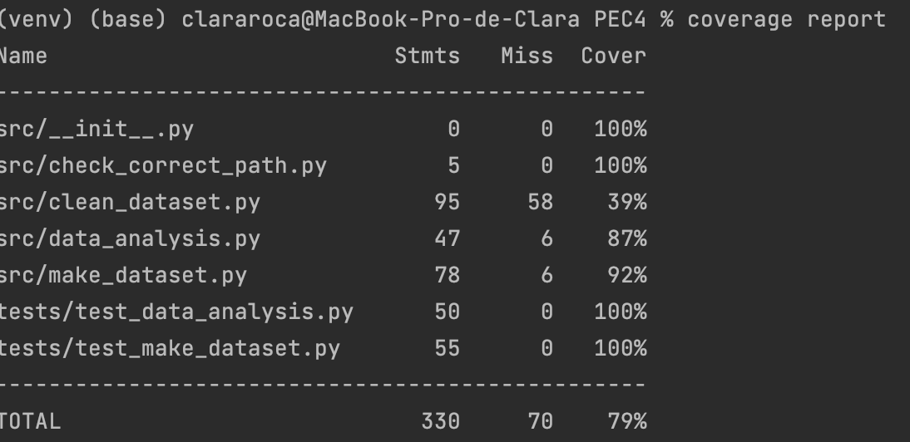

# Structure
The project has the following structure:

|   PEC4
|   |-- LICENSE.txt
|   |-- README.md 
|   |-- Assignment.ipynb 
|   |-- main.py 
|   |-- data 
|       |-- dataset_cities
|           |-- images 
|               |-- berlin_000000_000019_leftImg8bit_20-10-2018.png
|               |-- ... 
|           |-- labels 
|               |-- berlin_000000_000019_leftImg8bit_20-10-2018.txt
|               |-- ... 
|       |-- processed_data.csv
|   |-- reports
|       |-- figures
|           |-- 3_Figure_1.png
|           |-- ...
|   |-- requirements.txt
|   |-- src
|       |-- __init__.py
|       |-- check_correct_path.py
|       |-- clean_dataset.py
|       |-- data_analysis.py
|       |-- data_visualization.py
|       |-- make_dataset.py
|   |-- tests
|       |-- test_files
|           |-- docs
|               |-- bad_txt
|                   |-- bad_float.txt                    
|                   |-- ...
                |-- good_txt
|                   |-- correct_columns.txt                    
|                   |-- int_range.txt
|           |-- sample_data
|               |-- images
|                   |-- bonn_000015_000019_leftImg8bit_14-03-2016.jpg           
|                   |-- ...
|               |-- labels
|                   |-- berlin_000000_000010_leftImg8bit_20-10-2018_wrong_size.txt          
|                   |-- ...
|           |-- processed_data_test.csv
|           |-- test_data.csv
|           |-- class_name.txt
|       |-- __init__.py
|       |-- create_test_dataset.py
|       |-- test_clean_dataset.py
|       |-- test_data_analysis.py
|       |-- test_make_dataset.py

We will attempt to summarize the work development. First, we will present a brief description of each of the main files.

# Main Files Description

**LICENSE.txt**

Type of license for the project.

**README.md**

You are reading it right now.

**Assignment.ipynb**

The assignment that is solved in **main.py**.

**main.py**

The file that needs to be executed in order to run the answers.

**data**
A document with the raw data.

The **processed_data.csv** document can also be found here. This is the final dataset. We could have included a subfolder called processed, but we have had many problems accessing subfolders from .py files and we decided not to take any more risks.

**reports**

Charts and images generated in this exercise.

**requirements.txt**

Libraries required for this project.

**src**

Source code. It includes:

*  *__init__.py*: To turn the folder into a package.
* *check_correct_path.py*: With a function that checks the path is correct.
* *make_dataset.py*: Module responsible for generating the dataset and, finally, saving it in .csv. It would be the starting and ending code.
* *clean_dataset.py*: Module with the functions responsible for cleaning the dataset.
* *data_analysis.py*: Data analysis module.
* *data_visualization.py*: Module that generates the visualizations and charts for the exercise.

**tests**

A folder with all the tests:

* *create_test_dataset.py*
* *test_clean_dataset.py*
* *test_data_analysis.py*
* *test_make_dataset.py*

In the *test_files* subfolder, there are two subfolders:

* *docs*: generated documentsby the tests
  * *bad_txt*
  * *good_txt*
* *sample_data*: modified dataset sampleto be used in the tests
  * *images*
  * *labels*
  * *class_name.txt*
  
  
The *test_data.csv* file is also available, which is the result of the dataset after running `create_test_dataset.py` and *processed_data_test.csv*, which is generated by running `test_make_dataset.py`. The *coverage_report* image is a screenshot showing the test coverage.

# Code execution
To start PEC4, we will have to run `main.py`.

# Notes on the assignment

## Exercise 1
We have decided to be conservative and keep all the data that was offered to us, such as the object id, which made certain checks easier. Others, such as the date, seemed useful for future analysis.

Although it was not specified in the statement, in the `create_dataset()` function, we have decided to include an additional argument called `return_nulls` that provides the possibility to report on the null values of the created dataset.

## Exercise 2
In the `delete_nonyolo()` function, an additional argument called `drop_nulls` is added, which allows to delete the null values if they exist.

## Exercise 3
To change the coordinates we use the following formula:

        x1 = x - w / 2
        y1 = y - h / 2

As can be seen in the `draw_bonding_boxes()` function of the `data_visualization.py` module.

## Exercise 4
We understand that from now on we will only use images with confidence greater than 0.4 and in YOLO format. This applies until the end of the PEC.

## Exercise 6
As we mentioned in the development of the PEC, we chose to use image metadata, although we are aware that it is a rather light wall to find defective images. We have not taken into account the name of the image either, as there was a valid image with one extra '_' and it would have been considered invalid.

With more time, we could have looked for a way to read the image by color ranges, structures such as buildings,...

# Test coverage

A sample of the data has been taken and modified to fit the tests. Additional documents have also been created. All of this can be found in tests -> test_files

Due to a lack of time, the graphical module has not been tested.

The coverage we get is 79% in total.

The formula has been chosen: `coverage run -m unittest discover tests` and then `coverage report` to visualize the report. 

# Bibliography
 JetBrains s.r.o. (2022) Step 1. create and run your first python project: Pycharm, PyCharm Help. Available at: https://www.jetbrains.com/help/pycharm/creating-and-running-your-first-python-project.html (Accessed: January 25, 2023).
 
Corralien (2021) How to add values above each bar in countplot in Seaborn in python?, Stack Overflow. Available at: https://stackoverflow.com/questions/70297248/how-to-add-values-above-each-bar-in-countplot-in-seaborn-in-python (Accessed: January 25, 2023). 

pandas (2023) DataFrame, DataFrame - pandas 1.5.3 documentation. Available at: https://pandas.pydata.org/docs/reference/frame.html (Accessed: January 25, 2023). 

Rodríguez, D. (2022) Gráficos de Barras en matplotlib, Analytics Lane. Available at: https://www.analyticslane.com/2022/07/05/graficos-de-barras-en-matplotlib/ (Accessed: January 25, 2023). 

StackOverflow (2017) Seaborn plots in a loop, Stack Overflow. Available at: https://stackoverflow.com/questions/41325160/seaborn-plots-in-a-loop (Accessed: January 25, 2023).

van der Geer, R. (2019) A practical guide to using Setup.py, GoDataDriven. Available at: https://godatadriven.com/blog/a-practical-guide-to-using-setup-py/ (Accessed: January 25, 2023).

Waskom, M. (2022) Seaborn.countplot#, seaborn.countplot - seaborn 0.12.2 documentation. Available at: https://seaborn.pydata.org/generated/seaborn.countplot.html (Accessed: January 25, 2023). 
